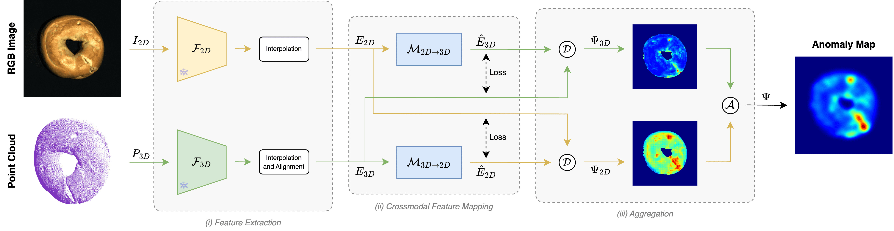

<h1 align="center"> Multimodal Industrial Anomaly Detection by Crossmodal Feature Mapping (CVPR 2024) </h1> 


<br>

:rotating_light: This repository contains download links to the datasets, code snippets, and checkpoints of our work "**Multimodal Industrial Anomaly Detection by Crossmodal Feature Mapping**",  [CVPR 2024](https://cvpr.thecvf.com/Conferences/2024)
 
by [Alex Costanzino*](https://alex-costanzino.github.io/), [Pierluigi Zama Ramirez*](https://pierlui92.github.io/), [Giuseppe Lisanti](https://www.unibo.it/sitoweb/giuseppe.lisanti), and [Luigi Di Stefano](https://www.unibo.it/sitoweb/luigi.distefano).  \* _Equal Contribution_

University of Bologna


<div class="alert alert-info">


<h2 align="center"> 

[Project Page](https://cvlab-unibo.github.io/CrossmodalFeatureMapping/) | [Paper](https://arxiv.org/abs/2312.04521)
</h2>


## :bookmark_tabs: Table of Contents

1. [Introduction](#clapper-introduction)
2. [Datasets](#file_cabinet)
3. [Checkpoints](#inbox_tray)
4. [Code](#memo-code)
6. [Contacts](#envelope-contacts)

</div>

## :clapper: Introduction
Recent advancements have shown the potential of leveraging both point clouds and images to localize anomalies. 
Nevertheless, their applicability in industrial manufacturing is often constrained by significant drawbacks, such as the use of memory banks, which lead to a substantial increase in terms of memory footprint and inference time.
We propose a novel light and fast framework that learns to map features from one modality to the other on nominal samples and detect anomalies by pinpointing inconsistencies between observed and mapped features.
Extensive experiments show that our approach achieves state-of-the-art detection and segmentation performance, in both the standard and few-shot settings, on the MVTec 3D-AD dataset while achieving faster inference and occupying less memory than previous multimodal AD methods. 
Furthermore, we propose a layer pruning technique to improve memory and time efficiency with a marginal sacrifice in performance.

<h4 align="center">

</h4>



:fountain_pen: If you find this code useful in your research, please cite:

```bibtex
@inproceedings{costanzino2024cross,
    title = {Multimodal Industrial Anomaly Detection by Crossmodal Feature Mapping},
    author = {Costanzino, Alex and Zama Ramirez, Pierluigi and Lisanti, Giuseppe and Di Stefano, Luigi},
    booktitle = {Proceedings of the IEEE Conference on Computer Vision and Pattern Recognition},
    note = {CVPR},
    year = {2024},
}
```

<h2 id="file_cabinet"> :file_cabinet: Datasets </h2>

In our experiments, we employed two datasets featuring rgb images and point clouds: [MVTec 3D-AD](https://www.mvtec.com/company/research/datasets/mvtec-3d-ad) and [Eyecandies](https://eyecan-ai.github.io/eyecandies/). You can preprocess them with the scripts contained in `processing`.


<h2 id="inbox_tray"> :inbox_tray: Checkpoints </h2>

Here, you can download the weights of **CFMs** employed in the results of Table 1 and Table 2 of our paper.

To use these weights, please follow these steps:

1. Create a folder named `checkpoints/checkpoints_CFM_mvtec` in the project directory;
2. Download the weights [[Download]](https://t.ly/DZ-o1);
3. Copy the downloaded weights into the `checkpoints_CFM_mvtec` folder.


## :memo: Code

<div class="alert alert-info">

**Warning**:
- The code utilizes `wandb` during training to log results. Please be sure to have a wandb account. Otherwise, if you prefer to not use `wandb`, disable it in `cfm_training.py` with the `flag mode = 'disabled'`.

</div>


### :hammer_and_wrench: Setup Instructions

**Dependencies**: Ensure that you have installed all the necessary dependencies. The list of dependencies can be found in the `./requirements.txt` file.


### :rocket: Inference CFMs

The `cfm_inference.py` script test the CFMs. It can be used to generate anomaly maps.

You can specify the following options:
   - `--dataset_path`: Path to the root directory of the dataset.
   - `--checkpoint_folder`: Path to the directory of the checkpoints, i.e., `checkpoints/checkpoints_CFM_mvtec`.
   - `--class_name`: Class on which the CFMs was trained.
   - `--epochs_no`: Number of epochs used in CFMs optimization.
   - `--batch_size`: Number of samples per batch employed for CFMs optimization.
   - `--qualitative_folder`: Folder on which the anomaly maps are saved.
   - `--quantitative_folder`: Folder on which the metrics are saved.
   - `--visualize_plot`: Flag to visualize qualitatived during inference.
   - `--produce_qualitatives`: Flag to save qualitatived during inference.

You can reproduce the results of Table 1 and Table 2 of the paper by running `02_eval_mvtec.sh`.

If you haven't downloaded the checkpoints yet, you can find the download links in the **Checkpoints** section above.


### :rocket: Train CFMs

To train CFMs refer to the example in `01_train_mvtec.sh` and `03_train_eyecandies.sh`.

The `cfm_training.py` script train the CFMs.

You can specify the following options:
   - `--dataset_path`: Path to the root directory of the dataset.
   - `--checkpoint_savepath`: Path to the directory on which checkpoints will be saved, i.e., `checkpoints/checkpoints_CFM_mvtec`.
   - `--class_name`: Class on which the CFMs are trained.
   - `--epochs_no`: Number of epochs for CFMs optimization.
   - `--batch_size`: Number of samples per batch for CFMs optimization.


## :envelope: Contacts

For questions, please send an email to alex.costanzino@unibo.it or pierluigi.zama@unibo.it.


## :pray: Acknowledgements

We would like to extend our sincere appreciation to the authors of the following projects for making their code available, which we have utilized in our work:

- We would like to thank the authors of [M3DM](https://github.com/nomewang/M3DM), [3D-ADS](https://github.com/eliahuhorwitz/3D-ADS) and [AST](https://github.com/marco-rudolph/AST) for providing their code, which has been instrumental in our experiments.